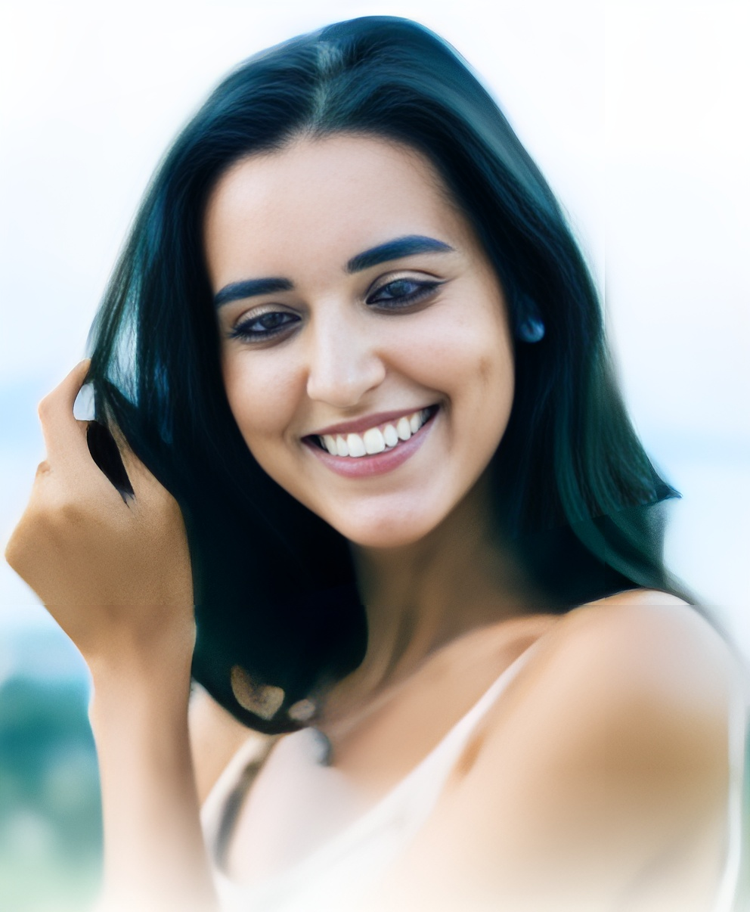
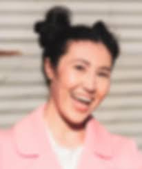
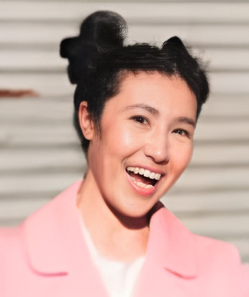

# AI Photo Restoration Application

This application uses GFPGAN (Generative Facial Prior-GAN) to restore old, damaged, or low-quality photos, particularly focusing on facial restoration and enhancement.

## Examples of Photo Restoration

### Example 1: Facial Detail Enhancement
| Before | After |
|--------|--------|
|  |  |
*Key Improvements:*
- Enhanced facial features clarity
- Improved skin texture
- Better detail in eyes and facial features
- Preserved original expression and identity

### Example 2: Old Photo Restoration
| Before | After |
|--------|--------|
|  |  |
*Key Improvements:*
- Removed scratches and damage
- Enhanced color balance
- Improved overall sharpness
- Restored lost facial details

### Example 3: Low Resolution Enhancement
| Before | After |
|--------|--------|
|  |  |
*Key Improvements:*
- Increased resolution
- Enhanced facial details
- Improved image clarity
- Better color reproduction

## Key Features

1. **Face Restoration**
   - Enhances facial features
   - Restores missing details
   - Maintains natural look
   - Preserves identity

2. **Image Enhancement**
   - Improves resolution
   - Removes noise and artifacts
   - Enhances color balance
   - Sharpens details

3. **Damage Repair**
   - Removes scratches
   - Fixes color fading
   - Repairs tears and marks
   - Restores damaged areas

## Technical Details

The application uses state-of-the-art AI models:
- **GFPGAN**: For facial restoration
- **Real-ESRGAN**: For background enhancement
- Processing resolution: Up to 2K
- Average processing time: 2-5 seconds per image

## Usage Guidelines

For best results:
1. Input images should be clear enough to identify faces
2. Works best with front-facing portraits
3. Can handle multiple faces in one image
4. Supports common image formats (JPG, PNG)

## Limitations

- Very severe damage might not be fully restored
- Extreme angles might affect face restoration quality
- Processing time increases with image size
- Results may vary based on input image quality

## Installation and Setup

```
git clone https://github.com/TencentARC/GFPGAN.git
cd GFPGAN
pip install -r requirements.txt
python setup.py develop
```

```
uvicorn main:app --host 0.0.0.0 --port 8000
```